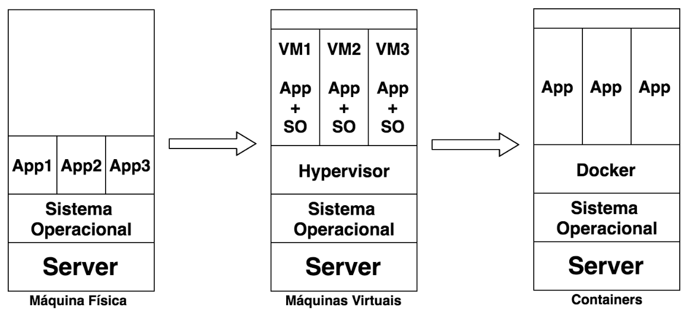
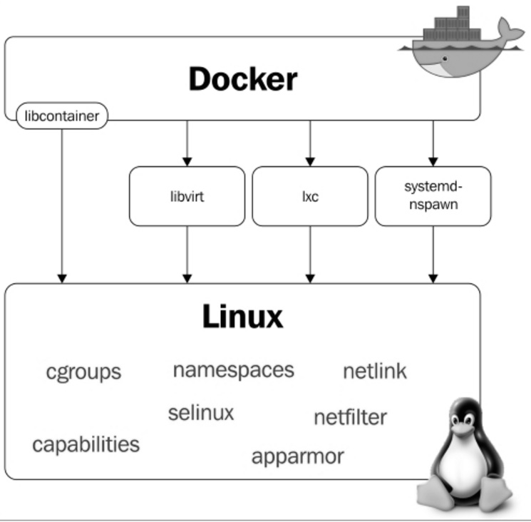

# Descomplicando Containers - DAY-01

- [Descomplicando Containers - DAY-01](#descomplicando-containers---day-01)
- [O que é container?](#o-que-é-container)
  - [Então vamos lá, o que é um container?](#então-vamos-lá-o-que-é-um-container)
  - [E quando começou que eu não vi?](#e-quando-começou-que-eu-não-vi)
- [O que é o Docker?](#o-que-é-o-docker)
  - [Onde entra o Docker nessa história?](#onde-entra-o-docker-nessa-história)
  - [E esse negócio de camadas?](#e-esse-negócio-de-camadas)
    - [Copy-On-Write (COW) e Docker](#copy-on-write-cow-e-docker)
  - [Storage drivers](#storage-drivers)
    - [AUFS (Another Union File System)](#aufs-another-union-file-system)
    - [Device Mapper](#device-mapper)
    - [OverlayFS e OverlayFS2](#overlayfs-e-overlayfs2)
    - [BTRFS](#btrfs)
  - [Docker Internals](#docker-internals)
  - [Namespaces](#namespaces)
    - [PID namespace](#pid-namespace)
    - [Net namespace](#net-namespace)
    - [Mnt namespace](#mnt-namespace)
    - [IPC namespace](#ipc-namespace)
    - [UTS namespace](#uts-namespace)
    - [User namespace](#user-namespace)
  - [Cgroups](#cgroups)
  - [Netfilter](#netfilter)
  - [Para quem ele é bom?](#para-quem-ele-é-bom)
- [Instalando o Docker](#instalando-o-docker)
  - [Quero instalar, vamos lá?](#quero-instalar-vamos-lá)
  - [Instalando no Debian/Centos/Ubuntu/Suse/Fedora](#instalando-no-debiancentosubuntususefedora)
  - [Instalando 'manualmente' no Debian](#instalando-manualmente-no-debian)
    - [Dica importante](#dica-importante)
- [Criando e administrando containers Docker](#criando-e-administrando-containers-docker)
  - [Então vamos brincar com esse tal de container!](#então-vamos-brincar-com-esse-tal-de-container)
  - [Legal, quero mais!](#legal-quero-mais)
    - [Modo interativo](#modo-interativo)
    - [Daemonizando o container](#daemonizando-o-container)
  - [Entendi, agora vamos praticar um pouco?](#entendi-agora-vamos-praticar-um-pouco)
  - [Tá, agora quero sair...](#tá-agora-quero-sair)
  - [Posso voltar ao container?](#posso-voltar-ao-container)
  - [Continuando com a brincadeira...](#continuando-com-a-brincadeira)
  - [Subindo e matando containers...](#subindo-e-matando-containers)
  - [Visualizando o consumo de recursos pelo container...](#visualizando-o-consumo-de-recursos-pelo-container)
- [docker container logs \[CONTAINER ID\]](#docker-container-logs-container-id)
- [docker container logs -f \[CONTAINER ID\]](#docker-container-logs--f-container-id)
  - [Cansei de brincar de container, quero removê-lo!](#cansei-de-brincar-de-container-quero-removê-lo)


# O que é container?


---

## Então vamos lá, o que é um container?

Container é, em português claro, o agrupamento de uma aplicação junto com suas dependências, que compartilham o kernel do sistema operacional do host, ou seja, da máquina (virtual ou física) onde está rodando. Deu para entender?

Containers são bem similares às máquinas virtuais, porém mais leves e mais integrados ao sistema operacional da máquina host, uma vez que, como já dissemos, compartilha o seu kernel, o que proporciona melhor desempenho por conta do gerenciamento único dos recursos.

Na maioria dos casos, a imagem de um container é bastante enxuta, havendo somente o necessário para o funcionamento da aplicação, que, quando em execução, possui um pequeno overhead se comparada à mesma aplicação rodando nativamente no sistema operacional, grande parte disso por conta do compartilhamento dos recursos com a máquina host.

Quando estamos utilizando máquinas virtuais, nós emulamos um novo sistema operacional e virtualizamos todo o seu hardware utilizando mais recursos da máquina host, o que não ocorre quando utilizamos containers, pois os recursos são compartilhados. O ganho óbvio disso é a capacidade de rodar mais containers em um único host, se comparado com a quantidade que se conseguiria com máquinas virtuais.

A seguir, na figura, podemos notar as diferenças de quando temos aplicações sendo executadas nativamente, máquinas virtuais e por fim em containers. Repare que não é necessário emular um novo sistema operacional quando estamos utilizando containers, diferentemente das máquinas virtuais.



Outro ponto interessante na utilização de containers é a portabilidade. Não importa em qual ambiente você criou o seu container, ele irá rodar em qualquer outro que possua, no nosso caso, o Docker instalado, seja ele no Linux, MacOS ou Windows. Você não precisa se preocupar com suas dependências, está tudo dentro do container. :D

O desenvolvedor consegue, na sua própria máquina, criar uma aplicação em container e depois executá-la em um servidor de produção sem nenhum problema de dependência ou algo do tipo -- nem mesmo o bom e velho "engraçado, na minha máquina funciona" escapa, hein?

Lembre-se: na máquina virtual você emula um novo sistema operacional dentro do sistema operacional do host. Já no container você emula somente as aplicações e suas dependências tornando-o portátil.

## E quando começou que eu não vi?

Apesar de o termo ter se tornado hype nos últimos anos, durante décadas já utilizávamos containers em sistemas Unix através do comando chroot. Sim, bem mais simplório, é verdade, pois era apenas uma forma de isolar o filesystem, mas já era o começo!

Em seguida vieram os jails do FreeBSD, que, além do isolamento do filesystem, permitiam também o isolamento de processos, seguidos de perto pela Sun, que desenvolveu o Solaris Zones, mais uma solução baseada em containers, porém somente para sistemas Solaris.

O grande passo rumo ao cenário que temos hoje foi a criação, pela Parallels do Virtuozzo, de um painel que permitia o fácil gerenciamento de containers e a disponibilização do core do Virtuozzo como open source com o nome de OpenVZ.

O OpenVZ foi uma ferramenta que ganhou bastante destaque no gerenciamento de containers e ajudou e muito na popularização do VPS (Virtual Private Server) e, consequentemente, na criação de centenas de empresas de hosting espalhadas pelo mundo. O principal ponto negativo do OpenVZ era a necessidade de aplicar um patch no kernel Linux.

Logo após surgir o OpenVZ, o Google iniciou o desenvolvimento do CGroups para o kernel do Linux e iniciou a utilização de containers em seus datacenters.

Em 2008, desenvolvedores de empresas como Virtuozzo, IBM e o próprio Google iniciaram o projeto LXC, que trazia consigo o CGroups, namespaces e chroot para prover uma completa e estável solução para a criação e o gerenciamento de containers.

Porém, foi no ano de 2013 que os containers conquistaram o mainstream, saíram do underground através da utilização massiva pelas empresas de internet e gigantes de tecnologia e invadiram os principais eventos de tecnologia ao redor do mundo, com palestras sobre o sucesso na utilização de containers e com o melhor aproveitamento dos recursos físicos como CPU e memória, maior agilidade no deployment de novas aplicações em fração de segundos e tudo isso com uma facilidade que impressiona. Amigo, estamos falando do simplesmente sensacional **Docker**.

---

# O que é o Docker?
## Onde entra o Docker nessa história?

Tudo começou em 2008, quando Solomon Hykes fundou a dotCloud, empresa especializada em PaaS com um grande diferencial: o seu Platform-as-a-Service não era atrelado a nenhuma linguagem de programação específica, como era o caso, por exemplo, da Heroku, que suportava somente aplicações desenvolvidas em Ruby.

A grande virada na história da dotCloud ocorreu em março de 2013, quando decidiram tornar open source o core de sua plataforma -- assim nascia o Docker!

As primeiras versões do Docker nada mais eram do que um wrapper do LXC integrado ao Union Filesystem, mas o seu crescimento foi fantástico e muito rápido, tanto que em seis meses seu GitHub já possuía mais de seis mil stars e mais de 170 pessoas contribuindo para o projeto ao redor do mundo.

Com isso, a dotCloud passou a se chamar Docker e a versão 1.0 foi lançada apenas 15 meses após sua versão 0.1. A versão 1.0 do Docker trouxe muito mais estabilidade e foi considerada "production ready", além de trazer o Docker Hub, um repositório público para containers.

Por ser um projeto open source, qualquer pessoa pode visualizar o código e contribuir com melhorias para o Docker. Isso traz maior transparência e faz com que correções de bugs e melhorias aconteçam bem mais rápido do que seria em um software proprietário com uma equipe bem menor e poucos cenários de testes.

Quando o Docker 1.0 foi lançado e anunciado que estava pronto para produção, empresas como Spotify já o utilizavam em grande escala; logo AWS e Google começaram a oferecer suporte a Docker em suas nuvens. Outra gigante a se movimentar foi a Red Hat, que se tornou uma das principais parceiras do Docker, inclusive o incorporando-o ao OpenShift.

Atualmente, o Docker é oficialmente suportado apenas em máquinas Linux 64 bits. Isso significa que seus containers também terão que ser um Linux 64 bits, pois lembre que o container utiliza o mesmo kernel da máquina host. ;)

Hoje o Docker pode ser executado tranquilamente em outras plataformas como Windows e MacOS, porém ainda não com a mesma performance e estabilidade do Docker sendo executado no Linux. Ahhh, o Linux! ❤️ ❤️ ❤️


## E esse negócio de camadas?

### Copy-On-Write (COW) e Docker
Antes de entender as camadas propriamente ditas, precisamos entender como um dos principais requisitos para essa coisa acontecer, o Copy-On-Write (ou COW para os íntimos), funciona. Nas palavras do próprio Jérome Petazzoni:

It's a little bit like having a book. You can make notes in that book if you want, but each time you approach the pen to the page, suddenly someone shows up and takes the page and makes a xerox copy and hand it back to you, that's exactly how copy on write works.

Em tradução livre, seria como se você tivesse um livro e que fosse permitido fazer anotações nele caso quisesse, porém, cada vez que você estivesse prestes a tocar a página com a caneta, de repente alguém aparecesse, tirasse uma xerox dessa página e entregasse a cópia para você. É exatamente assim que o Copy-On-Write funciona.

Basicamente, significa que um novo recurso, seja ele um bloco no disco ou uma área em memória, só é alocado quando for modificado.

Tá, mas o que isso tudo tem a ver com o Docker? Bom, como você sabe, o Docker usa um esquema de camadas, ou layers, e para montar essas camadas são usadas técnicas de Copy-On-Write. Um container é basicamente uma pilha de camadas compostas por N camadas read-only e uma, a superior, read-write.

## Storage drivers
Apesar de um container possuir uma camada de escrita, na maior parte do tempo você não quer escrever dados diretamente nele, por vários motivos, dentre eles a sua natureza volátil. Em situações onde sua aplicação gera dados, você vai preferir usar volumes "atachados" ao container e escrever neles (veremos mais à frente como fazer isso). Porém, em algumas situações é, sim, necessária a escrita local no container, e é aí que o storage driver entra na história. Storage driver é o mecanismo utilizado pela engine do Docker para ditar a forma como esses dados serão manipulados no filesystem do container. A seguir, os principais storage drivers e suas peculiaridades.

### AUFS (Another Union File System)
O primeiro filesystem disponível para o Docker foi o AUFS, um dos mais antigos Copy-On-Write filesystems, e inicialmente teve que passar por algumas modificações a fim de melhorar a estabilidade.

O AUFS funciona no nível de arquivos (não em bloco), e a ideia é ter múltiplos diretórios (camadas) que ele apresenta para o SO como um ponto único de montagem.

Quando você tenta ler um arquivo, a busca é iniciada pela camada superior, até achar o arquivo ou concluir que ele não existe. Para escrever em um arquivo, este precisa primeiro ser copiado para a camada superior (writable) -- e, sim, você adivinhou: escrever em arquivos grandes pode causar certa degradação da performance, já que o arquivo precisaria ser copiado completamente para a primeira camada, mesmo quando uma parte bem pequena vai sofrer alteração.

Já que estamos falando de coisa chata, outra coisa que pode degradar a sua performance usando AUFS é o fato de que ele procura cada diretório de um path em cada camada do filesystem toda vez que você tentar executar um comando. Por exemplo, se você tem um path com cinco camadas, serão realizadas 25 buscas (stat(), uma system call). Isso pode ser bem complicado em aplicações que fazem load dinâmico, como os apps Python que importam os .py da vida.

Outra particularidade é quando algum arquivo é deletado. Quando isso acontece é criado um whiteout para esse arquivo. Em outras palavras, ele é renomeado para ".wh.arquivo" e fica indisponível para o container, já que, né, não dá para apagar de verdade, pois as outras camadas são read-only.

### Device Mapper
Device Mapper é um kernel-based framework da Red Hat usado para algumas abstrações, como, por exemplo, o mapeamento de "blocos físicos" em "blocos lógicos", permitindo técnicas como LVM e RAID. No contexto do Docker, porém, ele se resume ao "thin provisioning target" ou ao storage driver "devicemapper". Assim que essa coisa de Docker começou a andar, o pessoal da Red Hat (e toda a galera que usava alguma distro relacionada com Red Hat) se interessou bastante, só que havia um problema: eles não queriam usar AUFS. Para resolver isso, eles reuniram uma equipe de engenheiros muito habilidosos que adicionaram suporte ao Device Mapper no Docker.

Em se tratando de Docker, o Device Mapper e o AUFS são bem similares: a grande diferença entre eles é que, no Device Mapper, quando você precisa escrever no arquivo, a cópia é feita em nível de blocos, que era um problema lá no AUFS, e com isso você ganha uma granularidade bem maior. Em teoria, o problema que você tinha quando escrevia um arquivo grande desaparece. Por padrão, Device Mapper escreve em arquivos de loopback, o que deixa as coisas mais lentas, mas agora na versão 1.17+ você já pode configurá-lo em modo direct-lvm, que escreve em blocos e, em teoria, resolveria esse problema. É um pouco mais chatinho de configurar, mas é uma solução mais elegante para ambientes em produção.

Além de AUFS e Device Mapper, você também pode usar BRTFS e OverlayFS como storage driver. Por serem tecnologias relativamente jovens, aprecie com moderação.

### OverlayFS e OverlayFS2
A bola da vez. Uma versão melhorada do AUFS, o OverlayFS e sua versão seguinte e oficialmente recomendada pelo Docker, o Overlay2, são ambos other union filesystems, mas dessa vez muito mais eficientes, rápidos e com uma implementação muito mais simples.

Por serem union file systems, também compartilham da ideia de juntar vários diretórios em um único ponto de montagem como nosso amigo AUFS, porém, no caso do OverlayFS, apenas dois diretórios são suportados, o que não acontece no Overlay2, que tem suporte multi-layer. Ambos suportam page caching sharing, ou seja, múltiplos containers acessando o mesmo arquivo dividem a mesma entrada no arquivo de paginação, o que é um uso mais eficiente de memória.

Aquele problema antigo do AUFS de ter de copiar todo o arquivo para a camada de cima para escrever nele ainda persiste, porém no OverlayFS ele só é copiado uma vez e fica lá para que as outras escritas no mesmo arquivo possam acontecer mais rápido, então tem uma pequena vantagem.

Nota-se um consumo excessivo de inodes quando se usa OverlayFS. Esse é um problema resolvido no Overlay2, então sempre que possível busque usá-lo -- até porque, no geral, tem uma performance superior. Lembrando que kernel 4.0+ é pré-requisito para usar OverlayFS2.


### BTRFS
BTRFS é a geração seguinte de union filesystem. Ele é muito mais space-efficient, suporta muitas tecnologias avançadas de storage e já está incluso no mainline do kernel. O BTRFS, diferentemente do AUFS, realiza operações a nível de bloco e usa um esquema de thin provision parecido com o do Device Mapper e suporta copy-on-write snapshots. Você pode inclusive combinar vários devices físicos em um único BTRFS filesystem, algo como um LVM.

O BTRFS é suportado atualmente na versão CE apenas em distribuições debian-like e na versão EE apenas em SLES (Suse Linux Enterprise Server).

IMPORTANTE: alterar o storage drive fará com que qualquer container já criado se torne inacessível ao sistema local. Cuidado!


## Docker Internals
O Docker utiliza algumas *features* básicas do kernel Linux para seu funcionamento. A seguir temos um diagrama no qual é possível visualizar os módulos e *features* do kernel de que o Docker faz uso:




## Namespaces

Namespaces foram adicionados no kernel Linux na versão 2.6.24 e são eles que permitem o isolamento de processos quando estamos utilizando o Docker. São os responsáveis por fazer com que cada container possua seu próprio environment, ou seja, cada container terá a sua árvore de processos, pontos de montagens, etc., fazendo com que um container não interfira na execução de outro. Vamos saber um pouco mais sobre alguns namespaces utilizados pelo Docker.

### PID namespace
O PID namespace permite que cada container tenha seus próprios identificadores de processos. Isso faz com que o container possua um PID para um processo em execução -- e quando você procurar por esse processo na máquina host o encontrará; porém, com outra identificação, ou seja, com outro PID.

A seguir temos o processo "testando.sh" sendo executado no container.

Perceba o PID desse processo na árvore de processos dele:

```sh
root@c774fa1d6083:/# bash testando.sh &
[1] 7

root@c774fa1d6083:/# ps -ef
UID  PID PPID C STIME TTY TIME     CMD
root 1   0    0 18:06 ?   00:00:00 /bin/bash
root 7   1    0 18:07 ?   00:00:00 bash testando.sh
root 8   7    0 18:07 ?   00:00:00 sleep 60
root 9   1    0 18:07 ?   00:00:00 ps -ef

root@c774fa1d6083:/#
```

Agora, perceba o PID do mesmo processo exibido através do host:

```sh
root@linuxtips:~# ps -ef | grep testando.sh

root 2958 2593 0 18:12 pts/2 00:00:00 bash testando.sh
root 2969 2533 0 18:12 pts/0 00:00:00 grep --color=auto testando.sh

root@linuxtips:~#
```


Diferentes, né? Porém, são o mesmo processo. :)

### Net namespace
O Net Namespace permite que cada container possua sua interface de rede e portas. Para que seja possível a comunicação entre os containers, é necessário criar dois Net Namespaces diferentes, um responsável pela interface do container (normalmente utilizamos o mesmo nome das interfaces convencionais do Linux, por exemplo, a eth0) e outro responsável por uma interface do host, normalmente chamada de veth* (veth + um identificador aleatório). Essas duas interfaces estão linkadas através da bridge Docker0 no host, que permite a comunicação entre os containers através de roteamento de pacotes.

Conforme falamos, veja as interfaces. Interfaces do host:

```sh
root@linuxtips:~# ip addr

1: lo: <LOOPBACK,UP,LOWER_UP> mtu 65536 qdisc noqueue state UNKNOWN group default
       link/loopback 00:00:00:00:00:00 brd 00:00:00:00:00:00
       inet 127.0.0.1/8 scope host lo
           valid_lft forever preferred_lft forever
       inet6 ::1/128 scope host
           valid_lft forever preferred_lft forever
2: eth1: <BROADCAST,MULTICAST,UP,LOWER_UP> mtu 1500 qdisc pfifo_fast state UP group default qlen 1000
        link/ether 00:1c:42:c7:bd:d8 brd ff:ff:ff:ff:ff:ff
        inet 10.211.55.35/24 brd 10.211.55.255 scope global eth1
            valid_lft forever preferred_lft forever
        inet6 fdb2:2c26:f4e4:0:21c:42ff:fec7:bdd8/64 scope global dynamic
            valid_lft 2591419sec preferred_lft 604219sec
        inet6 fe80::21c:42ff:fec7:bdd8/64 scope link
            valid_lft forever preferred_lft forever
3: docker0: <BROADCAST,MULTICAST,UP,LOWER_UP> mtu 1500 qdisc noqueue state UP group default
        link/ether 02:42:c7:c1:37:14 brd ff:ff:ff:ff:ff:ff
        inet 172.17.0.1/16 scope global docker0
            valid_lft forever preferred_lft forever
        inet6 fe80::42:c7ff:fec1:3714/64 scope link
            valid_lft forever preferred_lft forever
5: vetha2e1681: <BROADCAST,MULTICAST,UP,LOWER_UP> mtu 1500 qdisc noqueue master docker0 state UP group default
        link/ether 52:99:bc:ab:62:5e brd ff:ff:ff:ff:ff:ff
        inet6 fe80::5099:bcff:feab:625e/64 scope link
             valid_lft forever preferred_lft forever
root@linuxtips:~#
```

Interfaces do container:

```sh
root@6ec75484a5df:/# ip addr

1: lo: <LOOPBACK,UP,LOWER_UP> mtu 65536 qdisc noqueue state UNKNOWN group default
        link/loopback 00:00:00:00:00:00 brd 00:00:00:00:00:00
        inet 127.0.0.1/8 scope host lo
            valid_lft forever preferred_lft forever
        inet6 ::1/128 scope host
            valid_lft forever preferred_lft forever
6: eth0: <BROADCAST,MULTICAST,UP,LOWER_UP> mtu 1500 qdisc noqueue state UP group default
        link/ether 02:42:ac:11:00:03 brd ff:ff:ff:ff:ff:ff
        inet 172.17.0.3/16 scope global eth0
            valid_lft forever preferred_lft forever
        inet6 fe80::42:acff:fe11:3/64 scope link
            valid_lft forever preferred_lft forever

root@6ec75484a5df:/#
```

Conseguiu visualizar as interfaces Docker0 e veth* do host? E a eth0 do container? Sim? Otémooo! :D

### Mnt namespace
É evolução do chroot. Com o Mnt Namespace cada container pode ser dono de seu ponto de montagem, bem como de seu sistema de arquivos raiz. Ele garante que um processo rodando em um sistema de arquivos não consiga acessar outro sistema de arquivos montado por outro Mnt Namespace.

### IPC namespace
Ele provê um SystemV IPC isolado, além de uma fila de mensagens POSIX própria.

### UTS namespace
Responsável por prover o isolamento de hostname, nome de domínio, versão do SO, etc.

### User namespace
O mais recente namespace adicionado no kernel Linux, disponível desde a versão 3.8. É o responsável por manter o mapa de identificação de usuários em cada container.


## Cgroups
É o cgroups o responsável por permitir a limitação da utilização de recursos do host pelos containers. Com o cgroups você consegue gerenciar a utilização de CPU, memória, dispositivos, I/O, etc.

## Netfilter
A já conhecida ferramenta iptables faz parte de um módulo chamado netfilter. Para que os containers consigam se comunicar, o Docker constrói diversas regras de roteamento através do iptables; inclusive utiliza o NAT, que veremos mais adiante no livro.

```sh
root@linuxtips:~# iptables -t nat -L
Chain PREROUTING (policy ACCEPT)
target prot opt source destination
DOCKER all -- anywhere anywhere ADDRTYPE match dst-type LOCAL

Chain INPUT (policy ACCEPT)
target prot opt source destination

Chain OUTPUT (policy ACCEPT)
target prot opt source destination
DOCKER all -- anywhere !127.0.0.0/8 ADDRTYPE match dst-type LOCAL

Chain POSTROUTING (policy ACCEPT)
target prot opt source destination
MASQUERADE all -- 172.17.0.0/16 anywhere

Chain DOCKER (2 references)
target prot opt source destination
RETURN all -- anywhere anywhere

root@linuxtips:~#
```


## Para quem ele é bom?
O Docker é muito bom para os desenvolvedores, pois com ele você tem liberdade para escolher a sua linguagem de programação, seu banco de dados e sua distribuição predileta. Já para os sysadmins é melhor ainda, pois, além da liberdade de escolher a distribuição, não precisamos preparar o servidor com todas as dependências da aplicação. Também não precisamos nos preocupar se a máquina é física ou virtual, pois o Docker suporta ambas.

A empresa como um todo ganha, com a utilização do Docker, maior agilidade no processo de desenvolvimento de aplicações, encurtando o processo de transição entre os ambientes de QA STAGING e PROD, pois é utilizada a mesma imagem. Traz menos custos com hardware por conta do melhor gerenciamento e aproveitamento dos recursos, além do overhead, que é bem menor se comparado com outras soluções, como a virtualização.

Com Docker fica muito mais viável a criação de microservices (microsserviços, a ideia de uma grande aplicação ser quebrada em várias pequenas partes e estas executarem tarefas específicas), um assunto que tem ganhado cada vez mais espaço no mundo da tecnologia e que vamos abordar com mais detalhes no final deste livro.

Ainda temos diversos outros motivos para utilizar containers e que vamos descobrindo conforme evoluímos com a utilização do Docker. :D


# Instalando o Docker
## Quero instalar, vamos lá?
Bom, dado que você já sabe o que é um container e o que é o tal do Docker, chegou a hora de pôr a mão na massa. Vamos instalar o Docker pela primeira vez!

O daemon do Docker roda nativo em distribuições Linux, e por isso a instalação em sistemas operacionais que não sejam Linux consiste basicamente em subir uma VM e rodar o daemon de lá. O cliente, no entanto, pode ser instalado nos principais sistemas operacionais disponíveis atualmente.

Para realizar a instalação do Docker em máquinas Linux é bastante simples. Precisamos somente observar alguns pontos:

* O Docker não suporta processadores 32 bits.

* O Docker é suportado (stable) somente na versão do kernel 3.8 ou superior.

* O kernel deve ter suporte aos sistemas de arquivos utilizados pelo Docker, como o AUFS, Device Mapper, OverlayFS, etc.

* O kernel deverá ter suporte a cgroups e namespaces, o que normalmente já vem por default habilitado na maioria das distros.

Você também pode acessar a URL: https://docs.docker.com/install/. Lá é possível aprender a instalar o Docker em diversas distribuições Linux, nos principais clouds e também no MacOS e no Windows.

Neste livro vamos utilizar a distribuição Ubuntu Linux, porém não muda nada para outras distribuições. Chega de conversa, vamos lá!

Primeiro, vamos verificar a versão do kernel para saber se ele é compatível com o Docker:

```sh
uname -r
```

## Instalando no Debian/Centos/Ubuntu/Suse/Fedora
A instalação do Docker é bastante simples. Você pode optar por instalá-lo utilizando os pacotes disponíveis para sua distro -- por exemplo, o apt-get ou yum.

Nós preferimos fazer a instalação através da execução do curl a seguir, que irá executar um script e detectará qual a distribuição que estamos utilizando, para então adicionar o repositório oficial do Docker em nosso gerenciador de pacotes, o rpm ou apt, por exemplo.

```sh
curl -fsSL https://get.docker.com/ | sh
```

Assim ele sempre buscará a versão mais recente do Docker. :)

## Instalando 'manualmente' no Debian
Caso você esteja utilizando o Debian e queira realizar a instalação através dos pacotes disponíveis no repositório, faça:

```sh
apt-key adv --keyserver \
  hkp://pgp.mit.edu:80 --recv-keys 58118E89F3A912897C070ADBF76221572C52609D
```

Agora vamos criar/editar o arquivo `/etc/apt/sources.list.d/docker.list` e adicionar o endereço do repositório correspondente à versão do seu Debian. No nosso caso estamos utilizando a versão Debian 8, também conhecida como Jessie.

```sh
vim /etc/apt/sources.list.d/docker.list # Debian Jessie
deb https://apt.dockerproject.org/repo debian-jessie main
```

Após adicionar a linha anterior, é necessário atualizar a lista de repositórios executando:

```sh
apt-get update
```

Após finalizar a atualização da lista de repositórios disponíveis, já podemos fazer a instalação do Docker. O nome do pacote é "docker-ce". :)

```sh
apt-get install docker-ce
```

Vamos verificar se o Docker está em execução. Digite na linha de comando o seguinte:

```sh
/etc/init.d/docker status
```

Ou:

```sh
service docker status
```

```sh
docker container stop/waiting
```


Com isso, podemos verificar se o processo está em execução. Como podemos notar, o daemon do Docker não está em execução, portanto vamos iniciá-lo.

```sh
service docker start
docker container start/running, process 4303
```

```sh
service docker status
docker container start/running, process 4303
```

Perfeito! Agora já temos o Docker instalado e pronto para começar a brincar com os containers. \o/


### Dica importante
Por padrão, o daemon do Docker faz bind em um socket Unix, e não em uma porta TCP. Sockets Unix, por sua vez, são de propriedade e de uso exclusivo do usuário root (por isso o Docker sempre é iniciado como root), mas também podem ser acessados através do sudo por outros usuários.

Para evitar que você tenha que ficar usando sudo ao rodar comandos do Docker, crie um grupo chamado docker e adicione o seu usuário a ele. Pare o serviço e inicie-o novamente.

Infelizmente, nem tudo são flores. Esse procedimento faz com que o usuário tenha os mesmos privilégios do usuário root em operações relacionadas ao Docker. Mais informações no link: https://docs.docker.com/engine/security/.

Para criar um grupo no Linux e adicionar um usuário não tem segredo, basta rodar:

```sh
sudo usermod -aG docker user
```

Dica de um milhão de dólares: user = seu usuário. :D

# Criando e administrando containers Docker

## Então vamos brincar com esse tal de container!

Como todos sabemos, o Docker utiliza a linha de comando para que você possa interagir com ele -- basicamente você utiliza o comando "docker".

Bom, agora que já iniciamos o Docker, vamos rodar nosso primeiro container.

Como é de costume quando alguém está aprendendo uma nova linguagem de programação, é bem comum fazer como o primeiro código um hello world!

Apesar de o Docker não ser uma linguagem de programação, vamos utilizar esse costume com o nosso primeiro exemplo de um container em execução.

O Docker possui uma imagem personalizada de hello-world e serve para que você possa testar a sua instalação e validar se tudo funciona conforme o esperado. :D

Para que possamos executar um container, utilizamos o parâmetro "run" do subcomando "container" do comando "docker". Simples, não? :D

```sh
root@linuxtips:~# docker container run hello-world
Unable to find image 'hello-world:latest' locally
latest: Pulling from library/hello-world
03f4658f8b78: Pull complete a3ed95caeb02: Pull complete
Digest: sha256:8be990ef2aeb16dbcb9271ddfe2610fa6658d13f6dfb8bc72074cc1ca36966a7
Status: Downloaded newer image for hello-world:latest

Hello from Docker.
This message shows that your installation appears to be working correctly.
 1. The Docker client contacted the Docker daemon.
 2. The Docker daemon pulled the "hello-world" image from the Docker Hub.
    (amd64)
 3. The Docker daemon created a new container from that image which runs the
    executable that produces the output you are currently reading.
 4. The Docker daemon streamed that output to the Docker client, which sent it
    to your terminal.


To try something more ambitious, you can run an Ubuntu container with:
  $ docker run -it ubuntu bash

Share images, automate workflows, and more with a free Docker Hub account: 
  https://hub.docker.com

For more examples and ideas, visit: 
  https://docs.docker.com/userguide/

root@linuxtips:~#
```


No exemplo anterior, estamos executando um container utilizando a imagem personalizada do hello-world.

Apesar de ser uma tarefa simples, quando você executou o comando "docker container run hello-world" foram necessárias quatro etapas para sua conclusão, vamos ver quais:

1.  O comando "docker" se comunica com o daemon do Docker informando a ação desejada.

2.  O daemon do Docker verifica se a imagem "hello-world" existe em seu host; caso ainda não, o Docker faz o download da imagem diretamente do Docker Hub.

3. O daemon do Docker cria um novo container utilizando a imagem que você acabou de baixar.

4. O daemon do Docker envia a saída para o comando "docker", que imprime a mensagem em seu terminal.

Viu? É simples como voar! :)

Muito bem, agora que nós já temos uma imagem em nosso host, como eu faço para visualizá-la?

Muito simples, basta digitar o seguinte comando:

```sh
root@linuxtips:~# docker image ls
REPOSITORY  TAG    IMAGE ID     CREATED  SIZE
hello-world latest 690ed74de00f 5 months 960 B

root@linuxtips:~#
```

Como você pode notar no código, a saída traz cinco colunas:

* `REPOSITORY` -- O nome da imagem.

* `TAG` -- A versão da imagem.

* `IMAGE ID` -- Identificação da imagem.

* `CREATED` -- Quando ela foi criada.

* `SIZE` -- Tamanho da imagem.

Quando executamos o comando "docker container run hello-world", ele criou o container, imprimiu a mensagem na tela e depois o container foi finalizado automaticamente, ou seja, ele executou sua tarefa, que era exibir a mensagem, e depois foi finalizado.

Para ter certeza de que ele realmente foi finalizado, digite:

```sh
root@linuxtips:~# docker container ls

CONTAINER ID IMAGE COMMAND CREATED STATUS PORT NAMES

root@linuxtips:~#
```


Com o `docker container ls`, você consegue visualizar todos os containers em execução e ainda obter os detalhes sobre eles. A saída do `docker container ls` é dividida em sete colunas; vamos conhecer o que elas nos dizem:

* `CONTAINER ID` -- Identificação única do container.

* `IMAGE` -- A imagem que foi utilizada para a execução do container.

* `COMMAND` -- O comando em execução.

* `CREATED` -- Quando ele foi criado.

* `STATUS` -- O seu status atual.

* `PORTS` -- A porta do container e do host que esse container utiliza.

* `NAMES` -- O nome do container.

Uma opção interessante do "docker container ls" é o parâmetro "-a".

```sh
root@linuxtips:~# docker container ls -a

CONTAINER ID  IMAGE        COMMAND   CREATED    STATUS     PORTS      NAMES
6e45cf509282  hello-world  "/hello"  4 seconds  Exited(0)             tracted_ardinghelli

root@linuxtips:~#
```


Com a opção "-a" você consegue visualizar não somente os containers em execução, como também containers que estão parados ou que foram finalizados.

## Legal, quero mais!
Agora que vimos como criar um simples container, bem como visualizar as imagens e containers que estão em nosso host, vamos criar um novo, porém conhecendo três parâmetros que irão trazer maior flexibilidade no uso e na administração de nossos containers. Estou falando dos parâmetros "-t", "-i" e "-d".

* `-t` -- Disponibiliza um TTY (console) para o nosso container.

* `-i` -- Mantém o STDIN aberto mesmo que você não esteja conectado no container.

* `-d` -- Faz com que o container rode como um daemon, ou seja, sem a interatividade que os outros dois parâmetros nos fornecem.

Com isso temos dois modos de execução de nossos containers: modo interativo ou daemonizando o container.

### Modo interativo
Na maior parte das vezes você vai subir um container a partir de uma imagem que já está pronta, toda ajustadinha. Porém, há alguns casos em que você precisa interagir com o seu container -- isso pode acontecer, por exemplo, na hora de montar a sua imagem personalizada.

Nesse caso, usar o modo interativo é a melhor opção. Para isso, basta passar os parâmetros `-ti` ao comando `docker container run`.

### Daemonizando o container
Utilizando o parâmetro "-d" do comando `docker container run`, é possível daemonizar o container, fazendo com que o container seja executado como um processo daemon.

Isso é ideal quando nós já possuímos um container que não iremos acessar (via shell) para realizar ajustes. Imagine uma imagem já com a sua aplicação e tudo que precisa configurado; você irá subir o container e somente irá consumir o serviço entregue por sua aplicação. Se for uma aplicação web, basta acessar no browser passando o IP e a porta onde o serviço é disponibilizado no container. Sensacional, não?

Ou seja, se você quer subir um container para ser utilizado como uma máquina Linux convencional com shell e que necessita de alguma configuração ou ajuste, utilize o modo interativo, ou seja, os parâmetros `-ti`.

Agora, se você já tem o container configurado, com sua aplicação e todas as dependências sanadas, não tem a necessidade de usar o modo interativo -- nesse caso utilizamos o parâmetro `-d`, ou seja, o container daemonizado. Vamos acessar somente os serviços que ele provê, simples assim. :D

## Entendi, agora vamos praticar um pouco?
Perfeito. Vamos iniciar um novo container utilizando dois desses novos parâmetros que aprendemos.

Para o nosso exemplo, vamos subir um container do Centos 7:

```sh
root@linuxtips:~# docker container run -ti centos:7
Unable to find image 'centos:7' locally
7: Pulling from library/centos
a3ed95caeb02: Pull complete 196355c4b639: Pull complete
Digest: sha256:3cdc0670fe9130ab3741b126cfac6d7720492dd2c1c8ae033dcd77d32855bab2
Status: Downloaded newer image for centos:7

[root@3c975fb7fbb5 /]#
```

Como a imagem não existia em nosso host, ele começou a baixar do Docker Hub, porém, caso a imagem já estivesse em nosso host, ele a utilizaria, não sendo necessário o download.

Perceba que mudou o seu prompt (variável $PS1), pois agora você já está dentro do container. Para provar que estamos dentro do nosso container Centos, execute o seguinte comando:

```sh
[root@3c975fb7fbb5 /]# cat /etc/redhat-release
CentOS Linux release 7.2.1511 (Core)

[root@3c975fb7fbb5 /]#
```

O arquivo `/etc/redhat-release` indica qual a versão do Centos que estamos utilizando, ou seja, estamos realmente em nosso container Centos 7. :D

## Tá, agora quero sair...
Idealmente, no container vai haver apenas um processo rodando. No nosso caso, como estamos interagindo (opção `-ti`), é o processo do `bash`; logo, você não pode utilizar o comando `exit` para sair do console, pois dessa forma esse único processo para de rodar e seu container morre. Caso queira sair do container e mantê-lo em execução, é necessário sair com o seguinte atalho do teclado:

mantenha o botão Ctrl pressionado + p + q

Assim, você sairá do container e ele continuará em execução. Para confirmar se o container continua em execução, faça:

```sh
root@linuxtips:~# docker ps
CONTAINER ID  IMAGE     COMMAND      CREATED    STATUS        PORTS   NAMES
3c975fb7fbb5  centos:7  "/bin/bash"  2 minutes  Up 2 minutes           angry_wescoff

root@linuxtips:~#
```

## Posso voltar ao container?
Deixamos o nosso container em execução e agora queremos acessá-lo novamente. Como podemos fazer?

Simples! Basta digitar o seguinte comando:

```sh
root@linuxtips:~# docker container attach <CONTAINER ID>
```

O parâmetro `attach` do comando `docker container` possibilita nos conectarmos a um container em execução. Para isso, basta passar como parâmetro o `CONTAINER ID` que você consegue através da saída do `docker ps`, conforme mostramos no exemplo anterior.

## Continuando com a brincadeira...
Existe a possibilidade de criar um container, porém não o executar imediatamente. Quando fazemos o uso do parâmetro `create` do comando `docker container`, ele apenas cria o container, não o inicializando, conforme notamos no exemplo a seguir:

```sh
root@linuxtips:~# docker container create -ti ubuntu
Unable to find image 'ubuntu:latest' locally
latest: Pulling from library/ubuntu
5a132a7e7af1: Pull complete
fd2731e4c50c: Pull complete
28a2f68d1120: Pull complete
a3ed95caeb02: Pull complete
Digest:sha256:4e85ebe01d056b43955250bbac22bdb8734271122e3c78d21e55ee235fc6802d
Status: Downloaded newer image for  ubuntu:latest3e63e65db85a6e36950959dc6bdc00279e2208a335580c478e01723819de9467

root@linuxtips:~#
```

Perceba que quando você digita `docker container ls` ele não traz o container recém-criado, afinal a saída do `docker container ls` somente traz os containers em execução. Para visualizar o container recém-criado foi necessário utilizar o parâmetro `-a`.

```sh
root@linuxtips:~# docker container ls -a
CONTAINER ID  IMAGE    COMMAND       CREATED          STATUS    PORTS   NAMES
3e63e65db85a  ubuntu   "/bin/bash"   18 seconds ago   Created           elo_visves

root@linuxtips:~#
```

Para que o nosso container recém-criado seja executado, basta utilizar o `docker container start [CONTAINER ID]`, conforme segue:

```sh
root@linuxtips:~# docker container start [CONTAINER ID]
root@linuxtips:~# docker container attach [CONTAINER ID]

root@b422f04df14c:/#
```


Verificando se estamos realmente utilizando o container do Ubuntu:

```sh
root@b422f04df14c:/# cat /etc/issue
Ubuntu 18.04 LTS \n \l

root@b422f04df14c:/#
```


Lembrando que para sair do container e mantê-lo em execução é necessário utilizar o atalho: Ctrl + p + q.

## Subindo e matando containers...
Caso eu queira parar um container em execução, basta utilizar o parâmetro `stop` seguido do `CONTAINER ID`:

```sh
docker container stop [CONTAINER ID]
```

Verificando se o container continua em execução:

```sh
docker container ls
```

Lembrando que para visualizar os containers que não estão em execução é necessário utilizar o parâmetro `-a`.

Para colocar novamente em execução um container que está parado, é necessário utilizar o parâmetro `start` do comando `docker container` seguido do `CONTAINER ID`:

```sh
docker container start [CONTAINER ID]
```

Da mesma forma como podemos utilizar o stop/start para desligar/iniciar um container, podemos também fazer o uso do "restart", como notamos a seguir:

```sh
docker container restart [CONTAINER ID]
```

Para pausar um container, execute:

```sh
docker container pause [CONTAINER ID]
```

E verifique o status do container:

```sh
root@linuxtips:~# docker container ls
CONTAINER ID   IMAGE   COMMAND      CREATED         STATUS                 PORTS     NAMES
b34f4987bdce   ubuntu  "/bin/bash"  12 seconds ago  Up 11 seconds (Paused)           drunk_turi

root@linuxtips:~#
```

Para "despausar" o container:

```sh
docker container unpause [CONTAINER ID]
```

## Visualizando o consumo de recursos pelo container...
Caso você queira visualizar informações referentes ao consumo de recursos pelo container, também é bastante simples: basta utilizar o parâmetro "stats" para verificar o consumo de CPU, memória e rede pelo container em tempo real.

```sh
docker container stats [CONTAINER ID]

CONTAINER       CPU%     MEM USAGE/LIMIT     MEM %    NET I/O     BLOCK I/O   PIDS
b34f4987bdce    0.00%    503.8kB/2.094GB     0.02%    648B/648B   0B/0B       2
```

Para sair, pressione `Ctrl + C`.

Para visualizar todos os containers de uma só vez, basta não especificar o `[CONTAINER ID]`,conforme segue:

```sh
docker container stats
```

Agora, se você quer visualizar quais processos estão em execução em determinado container, utilize o parâmetro "top". Com ele você consegue informações sobre os processos em execução, como, por exemplo, UID e o PID do processo.

```sh
docker container top [CONTAINER ID]
UID  PID   PPID C STIME  TTY   TIME      COMMAND
root 10656 4303 0 20:24  pts/3 00:00:00  /bin/bash
```

Para verificar os logs de um determinado container, utilize o parâmetro `logs`, simples assim. :D

# docker container logs [CONTAINER ID]
Lembre-se: ele exibe o STDOUT, a saída padrão. Ou seja, normalmente você irá visualizar o histórico de mensagens que aparecerem em primeiro plano durante a execução do container.

Para exibir os logs de forma dinâmica, ou seja, conforme aparecem novas mensagens ele atualiza a saída no terminal utilizamos a opção "-f"

# docker container logs -f [CONTAINER ID]
Com isso seu terminal ficará travado, apenas escutando o log, e qualquer nova entrada ele exibirá na tela. Saída parecida com o `tail -f` no Linux. Lembre-se, utilize o `ctrl+c` para cancelar a exibição dos logs.

## Cansei de brincar de container, quero removê-lo!
Bem, remover um container é mais simples ainda do que sua criação. Quando removemos um container, a imagem que foi utilizada para a sua criação permanece no host; somente o container é apagado.

```sh
root@linuxtips:~# docker container rm b34f4987bdce

Failed to remove container (b34f4987bdce): Error response from daemon:
Conflict, You cannot remove a running container. Stop the container
before attempting removal or use -f

root@linuxtips:~#
```

Perceba que, quando você tentou remover o container, ele retornou um erro dizendo que falhou em remover, pois o container estava em execução. Ele inclusive recomenda que você pare o container antes de removê-lo ou então utilize a opção `-f`, forçando assim sua remoção.

```sh
root@linuxtips:~# docker container rm -f b34f4987bdce
b34f4987bdce

root@linuxtips:~#
```

Para confirmar a remoção do container, utilize o comando "docker container ls -a".