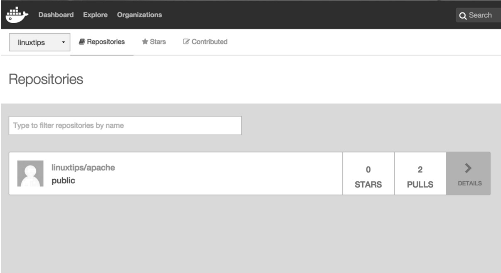

# Descomplicando Containers - DAY-02

- [Descomplicando Containers - DAY-02](#descomplicando-containers---day-02)
- [Meu primeiro e tosco dockerfile...](#meu-primeiro-e-tosco-dockerfile)
- [Criando e gerenciando imagens](#criando-e-gerenciando-imagens)
  - [Agora eu quero criar minha imagem, posso?](#agora-eu-quero-criar-minha-imagem-posso)
  - [Vamos começar do começo então, dockerfile!](#vamos-começar-do-começo-então-dockerfile)
- [Multi-stage](#multi-stage)
- [Entendendo volumes](#entendendo-volumes)
  - [Introdução a volumes no Docker](#introdução-a-volumes-no-docker)
  - [Criando volumes](#criando-volumes)
  - [Localizando volumes](#localizando-volumes)
  - [Criando e montando um data-only container](#criando-e-montando-um-data-only-container)
  - [Sempre é bom um backup...](#sempre-é-bom-um-backup)
- [Compartilhando as imagens](#compartilhando-as-imagens)
  - [O que é o Docker Hub?](#o-que-é-o-docker-hub)
  - [Vamos criar uma conta?](#vamos-criar-uma-conta)
  - [Agora vamos compartilhar essas imagens na *interwebs*!](#agora-vamos-compartilhar-essas-imagens-na-interwebs)
  - [Não confio na internet; posso criar o meu *registry* local?](#não-confio-na-internet-posso-criar-o-meu-registry-local)


# Meu primeiro e tosco dockerfile...
Tudo que nós fizemos até agora foi escrever na linha de comando, o que é OK para aprender. Porém, principalmente nos dias de hoje, não dá para viver mais sem automatizar as coisas -- se você, assim como nós, adora automatizar tudo que for possível, vai gostar bastante desse assunto.

O dockerfile nada mais é do que um arquivo onde você determina todos os detalhes do seu container, como, por exemplo, a imagem que você vai utilizar, aplicativos que necessitam ser instalados, comandos a serem executados, os volumes que serão montados, etc., etc., etc.!

É um makefile para criação de containers, e nele você passa todas as instruções para a criação do seu container.

Vamos ver como isso funciona na prática?

Primeira coisa: vamos criar um diretório onde deixaremos o nosso arquivo dockerfile, somente para ficar organizado. :D

Depois basta criar o dockerfile conforme exemplo a seguir:

```sh
mkdir /root/primeiro_dockerfile
cd /root/primeiro_dockerfile
vim Dockerfile
```

Vamos adicionar as instruções que queremos para essa imagem de container que iremos criar:

```sh
FROM debian

RUN /bin/echo "HELLO DOCKER"
```

Apenas isso por enquanto. Salve e saia do vim.

Agora vamos rodar o comando `docker build` para fazer a criação dessa imagem de container utilizando o dockerfile criado.

```sh
root@linuxtips:~/primeiro_dockerfile# docker build -t tosko:1.0 .
Sending build context to Docker daemon 2.048 kB
Step 1/2 : FROM debian
latest: Pulling from library/debian
fdd5d7827f33: Pull complete 
a3ed95caeb02: Pull complete
Digest: sha256:e7d38b3517548a1c71e41bffe9c8ae6d6d29546ce46bf62159837aad072c90aa
Status: Downloaded newer image for debian:latest
   ---> f50f9524513f
Step 2/2 : RUN /bin/echo "HELLO DOCKER"
   ---> Running in df60a0644bed 
HELLO DOCKER
   ---> fd3af97a8940
Removing intermediate container df60a0644bed
Successfully built fd3af97a8940
Successfully tagged tosko:1.0

root@linuxtips:~/primeiro_dockerfile#
```

Veja que usamos o diretório corrente, representado pelo caractere ".", para indicar o path do meu arquivo dockerfile, mas você não precisa necessariamente estar no mesmo diretório, basta passar o path do diretório onde o arquivo se encontra.

Lembre apenas que é o path do diretório e não do arquivo.

# Criando e gerenciando imagens

## Agora eu quero criar minha imagem, posso?

Claro que pode!

E mais, vamos aprender de duas formas simples e intuitivas.

Uma das coisas mais interessantes do Docker é a possibilidade de usar imagens criadas por outras pessoas ao redor do mundo através de algum registry como o Docker Hub. Isso agiliza muito a sua vida, ainda mais quando você precisa apenas testar uma determinada tecnologia. O POC (Proof of Concept -- em português, prova de conceito) se torna muito mais ágil, fazendo com que você consiga testar diversas ferramentas no mesmo tempo em que levaria para testar somente uma sem o Docker.

Entretanto, em determinados momentos precisamos criar a nossa própria imagem do zero, ou então modificar uma imagem criada por terceiros e salvar essas alterações em uma nova imagem.

Agora vamos ver os dois casos: como montar uma distribuição praticamente do zero utilizando somente instruções através do dockerfile e outra realizando modificações em uma imagem já existente e salvando em uma imagem nova.

## Vamos começar do começo então, dockerfile!

Vamos montar a nossa primeira imagem utilizando como roteiro de criação um dockerfile. Você verá o quanto é simples a criação de um dockerfile bem completo e prático. :)

Para começar, vamos criar um diretório chamado `/root/Dockerfiles`.

```sh
mkdir /root/Dockerfiles
```

Agora começaremos a criação do nosso dockerfile, nosso mapa de criação da imagem. Para que possamos organizá-lo melhor, vamos criar um diretório chamado "apache", onde guardaremos esse nosso primeiro exemplo:

```sh
cd /root/Dockerfiles/
mkdir apache
```


Por enquanto, vamos apenas criar um arquivo chamado "Dockerfile" e adicionar o conteúdo conforme exemplo a seguir:

```sh
cd apache
vim Dockerfile
```

```Dockerfile
FROM debian:10

RUN apt-get update && apt-get install -y apache2 && apt-get clean

ENV APACHE_LOCK_DIR="/var/lock"

ENV APACHE_PID_FILE="/var/run/apache2.pid"

ENV APACHE_RUN_USER="www-data"

ENV APACHE_RUN_GROUP="www-data"

ENV APACHE_LOG_DIR="/var/log/apache2"

LABEL description="Webserver"

VOLUME /var/www/html/

EXPOSE 80
```

Muito bom! Agora que você já adicionou as informações conforme o exemplo, vamos entender cada seção utilizada nesse nosso primeiro dockerfile:

* `FROM` -- Indica a imagem a servir como base.

* `RUN` -- Lista de comandos que deseja executar na criação da imagem.

* `ENV` -- Define variáveis de ambiente.

* `LABEL` -- Adiciona metadata à imagem, como descrição, versão, etc.

* `VOLUME` -- Define um volume a ser montado no container.

Após a criação do arquivo, vamos buildar (construir a nossa imagem) da seguinte forma:

```sh
docker build .
```

Lembre-se: você deverá estar no diretório onde está o seu dockerfile.

Todos os passos que definimos em nosso dockerfile serão realizados, como a instalação dos pacotes solicitados e todas as demais tarefas.

Muito bem! Como podemos notar na última linha da saída do `docker build`, a imagem foi criada com sucesso! :D

Vamos executar o `docker image ls` para ver se está tudo certo com a nossa primeira imagem!

```sh
root@linuxtips:~/Dockerfile/apache# docker image ls
REPOSITORY       TAG     IMAGE ID      CREATED         SIZE
<none>           <none>  53de2cee9e71  2 minutes ago   193.4 MB
```

A nossa imagem foi criada! Porém, temos um problema. :/

A imagem foi criada e está totalmente funcional, mas, quando a buildamos, não passamos o parâmetro `-t`, que é o responsável por adicionar uma tag ("nome:versão") à imagem.

Vamos executar novamente o build, porém passando o parâmetro `-t`, conforme o exemplo a seguir:

```sh
docker build -t linuxtips/apache:1.0 .
```

Agora vamos ver se realmente a imagem foi criada, adicionando um nome e uma versão a ela:

```sh
root@linuxtips:~/Dockerfile/apache# docker image ls
REPOSITORY         TAG   IMAGE ID      CREATED        SIZE
linuxtips/apache   1.0   53de2cee9e71  5 minutes ago  193.4 MB
```

Maravilha! Funcionou conforme esperávamos!

Vamos executar um container utilizando nossa imagem como base:

```sh
docker container run -ti linuxtips/apache:1.0
```

Agora já estamos no container. Vamos verificar se o Apache2 está em execução. Se ainda não estiver, vamos iniciá-lo e verificar se a porta 80 está `LISTEN`.

```sh
root@70dd36fe2d3b:/# ps -ef
UID          PID    PPID  C STIME TTY          TIME CMD
root           1       0  1 21:33 ?        00:00:00 /bin/bash
root           6       1  0 21:33 ?        00:00:00 ps -ef

root@70dd36fe2d3b:/# /etc/init.d/apache2 start
[....] Starting Apache httpd web server: apache2AH00558: apache2: Could not reliably determine the server's fully qualified domain name, using 172.17.0.4. Set the 'ServerName' directive globally to suppress this message
. ok 

root@70dd36fe2d3b:/# ps -ef
UID          PID    PPID  C STIME TTY          TIME CMD
root           1       0  0 21:33 ?        00:00:00 /bin/bash
root          30       1  0 21:33 ?        00:00:00 /usr/sbin/apache2 -k start
www-data      33      30  0 21:33 ?        00:00:00 /usr/sbin/apache2 -k start
www-data      34      30  0 21:33 ?        00:00:00 /usr/sbin/apache2 -k start
root         109       1  0 21:33 ?        00:00:00 ps -ef

root@70dd36fe2d3b:/# ss -atn
State      Recv-Q Send-Q     Local Address:Port    Peer Address:Port
LISTEN          0    128            :::80                :::*

root@70dd36fe2d3b:/# ip addr show eth0
50: eth0: <BROADCAST,MULTICAST,UP,LOWER_UP> mtu 1500 qdisc noqueue state UP group default
        link/ether 02:42:ac:11:00:04 brd ff:ff:ff:ff:ff:ff
        inet 172.17.0.4/16 scope global eth0
             valid_lft forever preferred_lft forever
        inet6 fe80::42:acff:fe11:4/64 scope link
             valid_lft forever preferred_lft forever

root@70dd36fe2d3b:/#
```

No código anterior é possível observar o IP do container na saída do `ip addr`. Vamos testar a comunicação com o container a partir do host.

No host, digite:

```sh
curl <IP DO CONTAINER>
```

O `curl` retornou a página de boas-vindas do Apache2, ou seja, tudo está funcionando muito bem e o Apache2, respondendo conforme esperado!

Maaaaaasssss, não é interessante que eu tenha que entrar no container para subir o meu processo do Apache. Todo container deve executar seu processo em primeiro plano e esse processo deve subir de forma automática e não com um serumaninho acessando o container e subindo o serviço. Vimos antes somente como primeiro exemplo, agora vamos aperfeiçoá-lo e deixá-lo como deve estar! :D

A primeira coisa é deixar o nosso dockerfile como segue:

```sh
vim Dockerfile
```

```Dockerfile
FROM debian:10

RUN apt-get update && apt-get install -y apache2 && apt-get clean

ENV APACHE_LOCK_DIR="/var/lock"

ENV APACHE_PID_FILE="/var/run/apache2/apache2.pid"

ENV APACHE_RUN_USER="www-data"

ENV APACHE_RUN_DIR="/var/run/apache2"

ENV APACHE_RUN_GROUP="www-data"

ENV APACHE_LOG_DIR="/var/log/apache2"

LABEL description="Webserver"

VOLUME /var/www/html/

EXPOSE 80

ENTRYPOINT ["/usr/sbin/apachectl"]

CMD ["-D", "FOREGROUND"]
```

Perceba que agora nós adicionamos mais duas opções: o `ENTRYPOINT` e o `CMD`!

Ficou curioso sobre o que eles fazem? Então 'bora aprender muito mais opções possíveis de serem adicionadas em um dockerfile!

Bora aprender um pouco mais sobre dockerfile?

Vamos agora aprender um pouco mais sobre as opções que podemos utilizar quando estamos criando um dockerfile:

* `ADD` -- Copia novos arquivos, diretórios, arquivos TAR ou arquivos remotos e os adiciona ao filesystem do container.

* `CMD` -- Executa um comando. Diferentemente do RUN, que executa o comando no momento em que está "buildando" a imagem, o CMD irá fazê-lo somente quando o container é iniciado.

* `LABEL` -- Adiciona metadados à imagem, como versão, descrição e fabricante.

* `COPY` -- Copia novos arquivos e diretórios e os adiciona ao filesystem do container.

* `ENTRYPOINT` -- Permite que você configure um container para rodar um executável. Quando esse executável for finalizado, o container também será.

* `ENV` -- Informa variáveis de ambiente ao container.

* `EXPOSE` -- Informa qual porta o container estará ouvindo.

* `FROM` -- Indica qual imagem será utilizada como base. Ela precisa ser a primeira linha do dockerfile.

* `MAINTAINER` -- Autor da imagem.

* `RUN` -- Executa qualquer comando em uma nova camada no topo da imagem e "commita" as alterações. Essas alterações você poderá utilizar nas próximas instruções de seu dockerfile.

* `USER` -- Determina qual usuário será utilizado na imagem. Por default é o root.

* `VOLUME` -- Permite a criação de um ponto de montagem no container.

* `WORKDIR` -- Responsável por mudar do diretório "/" (raiz) para o especificado nele.

Um detalhe superimportante de mencionar é que quando estamos trabalhando com o ENTRYPOINT e o CMD dentro do mesmo dockerfile, o CMD somente aceita parâmetros do ENTRYPOINT, conforme nosso exemplo do dockerfile anterior:

```Dockerfile
ENTRYPOINT ["/usr/sbin/apachectl"]

CMD ["-D", "FOREGROUND"]
```

Onde:

* `/usr/sbin/apachectl` -- Esse é o comando.

`"-D", "FOREGROUND"` -- Esse é o argumento, o parâmetro.

No shell, por exemplo, a execução ficaria assim:

```sh
/usr/sbin/apachectl -D FOREGROUND
```

Ou seja, assim você está iniciando o Apache passando a instrução para que ele seja iniciado em primeiro plano, como deve ser. :D

Para maiores detalhes sobre como criar imagens, veja essa apresentação criada pelo Jeferson: https://www.slideshare.net/jfnredes/images-deep-dive.


# Multi-stage
Um importante e recente recurso adicionado ao dockerfile visa facilitar a vida de quem pretende criar imagens de containers de forma efetiva. Esse cara é o multi-stage!

O multi-stage nada mais é do que a possibilidade de você criar uma espécie de pipeline em nosso dockerfile, podendo inclusive ter duas entradas `FROM`.

Esse recurso é muito utilizado quando queremos, por exemplo, compilar a nossa aplicação em um container e executá-la, porém não queremos ter aquela quantidade enorme de pacotes instalados em nossos containers necessários sempre quando se quer compilar códigos de alguma linguagem, como C, Java ou Golang.

Vamos a um exemplo para que possamos entender melhor como isso funciona!

Para isso, preparei uma app escrita em Golang superavançada para o nosso teste:

```go
// goapp.go
package main

import "fmt"

func main() {

    fmt.Println("GIROPOPS STRIGUS GIRUS - LINUXTIPS")

}
```

Achou que seria algo avançado? Impossível, fomos nós que fizemos. :D

Bem, agora vamos criar um dockerfile para criar a nossa imagem e assim executar a nossa app.

```Dockerfile
# Dockerfile

FROM golang:1.18
WORKDIR /app
COPY . ./
RUN go mod init hello
RUN go build -o /app/hello
CMD ["/app/hello"]
```


Pronto! Agora vamos realizar o build.

```sh
docker build -t goapp:1.0 .
```

Listando a nossa imagem:

```sh
docker image ls | grep goapp
goapp    1.0    50451808b384    11 seconds ago      781MB
```

Agora vamos executá-la e ver a nossa fantástica app em execução:

```sh
docker container run -ti goapp:1.0
GIROPOPS STRIGUS GIRUS -- LINUXTIPS
```

Pronto! Nossa app e nossa imagem estão funcionando! Sucesso!

Porém, podemos melhorar muita coisa se começarmos a utilizar o nosso poderoso recurso, o multi-stage!

Vamos refazer o nosso dockerfile utilizando o multi-stage, entender como ele funciona e a diferença entre as duas imagens.

Vamos deixar nosso dockerfile dessa maneira:

```Dockerfile
# Dockerfile
FROM golang:1.18 as buildando
WORKDIR /app
COPY . ./
RUN go mod init hello
RUN go build -o /app/hello

FROM alpine:3.15.9
COPY --from=buildando /app/hello /app/hello
CMD ["/app/hello"]
```

Perceba que agora nós temos duas entradas `FROM`, o que não era possível antes do multi-stage. Mas por que isso?

O que está acontecendo é que agora temos o dockerfile dividido em duas seções. Cada entrada `FROM` define o início de um bloco, uma etapa.

Então, em nosso primeiro bloco temos:

* `FROM golang AS buildando` -- Estamos utilizando a imagem do Golang para criação da imagem de container, e aqui estamos apelidando esse bloco como "buildando".

* `ADD . ./` -- Adicionando o código de nossa app dentro do container.

* `WORKDIR /app` -- Definindo que o diretório de trabalho é o "/app", ou seja, quando o container iniciar, estaremos nesse diretório.

* `RUN go build -o /app/hello` -- Vamos executar o build de nossa app Golang.


Já no segundo bloco temos o seguinte:

* `FROM alpine:3.15.9` -- Iniciando o segundo bloco e utilizando a imagem do Alpine para criação da imagem de container.

* `COPY --from=buildando /app/hello /app/hello` -- Aqui está a mágica: vamos copiar do bloco chamado "buildando" um arquivo dentro de "/app/hello" para o diretório "/app" do container que estamos tratando nesse bloco, ou seja, copiamos o binário que foi compilado no bloco anterior e o trouxemos para esse.

* `CMD ["/app/hello"]` -- Aqui vamos executar a nossa sensacional app. :)

Agora que já entendemos todas as linhas do nosso novo dockerfile, 'bora realizar o build dele.

```sh
docker build -t goapp_multistage:1.0 .
```

Vamos executar a nossa imagem para ver se está tudo funcionando:

```sh
docker container run -ti goapp_multistage:1.0
GIROPOPS STRIGUS GIRUS - LINUXTIPS
```

Será que existe diferença de tamanho entre elas? Vamos conferir:

```sh
docker image ls | grep goapp
goapp_multistage  1.0    dfe57485b7f0    22 seconds ago    7.07MB
goapp             1.0    50451808b384    15 minutes ago     781MB
```

A diferença de tamanho é brutal, pois em nossa primeira imagem precisamos ter um monte de pacotes para que o build da app Golang ocorra. Já em nossa segunda imagem também utilizamos a imagem do Golang e todos os seus pacotes para buildar a nossa app, porém descartamos a primeira imagem e somente copiamos o binário para o segundo bloco, onde estamos utilizando a imagem do Alpine, que é superenxuta.

Ou seja, utilizamos o primeiro bloco para compilar a nossa app e o segundo bloco somente para executá-la. Simples assim, simples como voar! :D


# Entendendo volumes
## Introdução a volumes no Docker
Bom, volumes nada mais são que diretórios externos ao container, que são montados diretamente nele, e dessa forma bypassam seu filesystem, ou seja, não seguem aquele padrão de camadas que falamos. Decepcionei você? Que bom, sinal de que é bem simples e você não vai ter problemas para entender. :)

A principal função do volume é persistir os dados. Diferentemente do filesystem do container, que é volátil e toda informação escrita nele é perdida quando o container morre, quando você escreve em um volume aquele dado continua lá, independentemente do estado do container.

Existem algumas particularidades entre os volumes e containers que valem a pena ser mencionadas:

* O volume é inicializado quando o container é criado.

* Caso ocorra de já haver dados no diretório em que você está montando como volume, ou seja, se o diretório já existe e está "populado" na imagem base, aqueles dados serão copiados para o volume.

* Um volume pode ser reusado e compartilhado entre containers.

* Alterações em um volume são feitas diretamente no volume.

* Alterações em um volume não irão com a imagem quando você fizer uma cópia ou snapshot de um container.

* Volumes continuam a existir mesmo se você deletar o container.

Dito isso, chega de papo. Vamos aprender a adicionar um volume em um container.

Primeiro, vamos ver como funciona da maneira antiga, que ainda é suportada, porém não é elegante. :)

Essa maneira é muito utilizada quando se quer montar um diretório específico do host dentro do container. Isso é ruim quando estamos trabalhando em cluster, uma vez que teríamos que garantir esse diretório criado em todos os hosts do cluster. Não seria legal.

Porém, podemos aprender como funciona e utilizar em algum momento, caso se faça necessário. Para evitar erros, primeiro crie o diretório "/volume" na sua máquina.

```sh
root@linuxtips:~# mkdir /volume
root@linuxtips:~# docker container run -ti --mount type=bind,src=/volume,dst=/volume ubuntu
root@7db02e999bf2:/# df -h

Filesystem                  Size  Used Avail Use%   Mounted on
none                         13G  6.8G 5.3G   57%   /
tmpfs                       999M     0 999M    0%   /dev
tmpfs                       999M     0 999M    0%   /sys/fs/cgroup
/dev/mapper/ubuntu--vg-root  13G  6.8G 5.3G   57%   /volume 
shm                          64M     0  64M    0%   /dev/shm

root@7db02e999bf2:/# ls
bin boot dev etc home lib lib64 media mnt opt proc root run sbin srv sys tmp usr var volume

root@7db02e999bf2:/#
```

No exemplo anterior, conhecemos um novo parâmetro do comando `docker container run`, o `--mount`.

O parâmetro `--mount` é o responsável por indicar o volume, que em nosso exemplo é o `/volume`, e onde ele será montado no container. Perceba que, quando passamos o parâmetro `--mount type=bind,src=/volume,dst=/volume`, o Docker montou esse diretório no container, porém sem nenhum conteúdo.

Podemos também montar um volume no container linkando-o com um diretório do host já com algum conteúdo. Para exemplificar, vamos compartilhar o diretório `/root/primeiro_container`, que utilizamos para guardar o nosso primeiro dockerfile, e montá-lo no container em um volume chamado `/volume` da seguinte forma:

```sh
docker container run -ti --mount type=bind,src=/root/primeiro_container,dst=/volume ubuntu

root@3d372a410ea2:/# df -h
Filesystem                   Size Used Avail  Use%  Mounted on
none                          13G 6.8G  5.3G   57%  /
tmpfs                        999M    0  999M    0%  /dev
tmpfs                        999M    0  999M    0%  /sys/fs/cgroup
/dev/mapper/ubuntu--vg-root   13G 6.8G  5.3G   57%  /volume
shm                           64M    0   64M    0%  /dev/shm

root@3d372a410ea2:/#
```


Com isso, estamos montando o diretório `/root/primeiro_dockerfile` do host dentro do container com o nome de `/volume`.

No container:

```sh
root@3d372a410ea2:/# ls /volume/
Dockerfile
root@3d372a410ea2:/#


No host:
```sh
root@linuxtips:~# ls /root/primeiro_dockerfile/
Dockerfile

root@linuxtips:~#
```

Caso eu queira deixar o volume no container apenas como read-only, é possível. Basta passar o parâmetro `ro` após o destino onde será montado o volume:

```sh
docker container run -ti --mount type=bind,src=/root/primeiro_container,dst=/volume,ro ubuntu
root@8d7863b1d9af:/# df -h

Filesystem                   Size   Used  Avail  Use%  Mounted on
none                          13G   6.8G   5.3G   57%  /
tmpfs                        999M      0   999M    0%  /dev
tmpfs                        999M      0   999M    0%  /sys/fs/cgroup
/dev/mapper/ubuntu--vg-root   13G   6.8G   5.3G   57%  /volume
shm                           64M      0    64M    0%  /dev/shm

root@8d7863b1d9af:/# cd /volume/
root@8d7863b1d9af:/volume# ls
Dockerfile

root@8d7863b1d9af:/volume# mkdir teste
mkdir: cannot create directory 'teste': Read-only file system

root@8d7863b1d9af:/volume#
```


Assim como é possível montar um diretório como volume, também é possível montar um arquivo:

```sh
docker container run -ti --mount type=bind,src=/root/primeiro_container/Dockerfile,dst=/Dockerfile ubuntu

root@df0e3e58280a:/# df -h

Filesystem                   Size   Used  Avail  Use%  Mounted on
none                          13G   6.8G   5.3G   57%  /
tmpfs                        999M      0   999M    0%  /dev
tmpfs                        999M      0   999M    0%  /sys/fs/cgroup
/dev/mapper/ubuntu--vg-root   13G   6.8G   5.3G   57%  /Dockerfile
shm                           64M      0    64M    0%  /dev/shm

root@df0e3e58280a:/# cat Dockerfile
FROM debian
RUN /bin/echo "HELLO DOCKER"

root@df0e3e58280a:/#
```

Isso faz com que o arquivo `/root/primeiro_dockerfile/Dockerfile` seja montado em "/Dockerfile" no container.

## Criando volumes
Agora vamos criar os volumes da maneira mais elegante e atual. Hoje temos a possibilidade de realizar o gerenciamento de volumes de maneira muito simples e inteligente.

Sempre que criamos um volume, ele cria um diretório com o mesmo nome dentro de `/var/lib/docker/volumes/`.

No exemplo a seguir, o volume `giropops` seria então criado em `/var/lib/docker/volumes/giropops`; com isso, todos os arquivos disponíveis nesse diretório também estariam disponíveis no local indicado no container. Vamos aos exemplos! :D

É possível fazer a criação de volumes e toda a sua administração através do comando:

```sh
docker volume create giropops
```

É possível removê-lo através do comando:

```sh
docker volume rm giropops
```

Para verificar detalhes sobre esse volume:

```sh
docker volume inspect giropops
```

Para remover os volumes que não estão sendo utilizados (use com extrema moderação! :D):

```sh
docker volume prune
```

Para que você possa montar o volume criado em algum container/service, basta executar o seguinte comando:

```sh
docker container run -d --mount type=volume,source=giropops,destination=/var/opa nginx
```

Onde:

* `--mount` -- Comando utilizado para montar volumes.

* `type=volume` -- Indica que o tipo é "volume". Ainda existe o tipo "bind", onde, em vez de indicar um volume, você indicaria um diretório como source.

* `source=giropops` -- Qual o volume que pretendo montar.

* `destination=/var/opa` -- Onde no container montarei esse volume.

Simples como voar, não?

## Localizando volumes
Caso você queira obter a localização do seu volume, é simples. Mas para isso você precisa conhecer o comando `docker volume inspect`.

Com o `docker volume inspect` você consegue obter detalhes do seu container, como, por exemplo, detalhes do volume.

A saída do comando `docker volume inspect` retorna mais informação do que somente o path do diretório no host. Vamos usar a opção `--format` ou `-f` para filtrar a saída do `inspect`.

```sh
docker volume inspect --format '{{ .Mountpoint }}' giropops
/var/lib/docker/volumes/giropopos/_data
```

## Criando e montando um data-only container
Uma opção bastante interessante em relação aos volumes diz respeito ao data-only container, cuja principal função é prover volumes para outros containers. Lembra do NFS server e do Samba? Ambos centralizavam diretórios com a finalidade de compartilhar entre outros servidores. Pois bem, o data-only container tem a mesma finalidade: prover volumes a outros containers.

Um dos grandes baratos do Docker é a portabilidade. Um container criado no seu laptop deve ser portátil a ponto de rodar em qualquer outro ambiente que utilize o Docker, em todos os cantos do universo!

Sendo assim, o que acontece se eu criar um ambiente em Docker que diz para os containers montarem um diretório do host local? Depende. Depende de como está esse tal host local. Perguntas como "o diretório existe?" "as permissões estão ajustadas?", entre outras mais, definirão o sucesso na execução dos containers, o que foge completamente do escopo do Docker.

Vamos ver como funciona isso na prática! :)

Para o nosso exemplo, primeiro vamos criar um container chamado `dbdados`, com um volume chamado `/data`, que guardará os dados de um banco PostgreSQL.

Para que possamos criar um container especificando um nome para ele, utilizamos o parâmetro "--name", conforme veremos no exemplo a seguir:

```sh
docker container create -v /data --name dbdados centos
```

Com isso, apenas criamos o container e especificamos um volume para ele, mas ainda não o iniciamos.

Sabemos que no container o volume se encontra montado em `/data`. Porém, qual a localização desse volume no host?

Lembra do `docker inspect`? Vamos utilizá-lo novamente:

```sh
root@linuxtips:~# docker inspect -f {{.Mounts}} dbdados

[{46255137fe3f6d5f593e9ba9aaaf570b2f8b5c870f587c2fb34f29b79f97c30c /var/lib/docker/volumes/46255137fe3f6d5f593e9ba9aaaf570b2f8b5c870f587c2fb34f29b79f97c30c/_data /data local true }]
```

Perceba que agora utilizamos o nome do container em vez do `CONTAINER ID`. Totalmente possível e muito mais intuitivo.

Quando executamos o `docker inspect`, ele nos retornou o caminho do nosso volume. Vamos ver se existe algum conteúdo dentro dele:

```sh
root@linuxtips:~# ls \
 /var/lib/docker/volumes/46255137fe3f6d5f593e9ba9aaaf570b2f8b5c870f587c2fb34f29b79f97c30c/_data
```

Como vimos, o diretório ainda não possui conteúdo.

Agora vamos criar os containers que rodarão o PostgreSQL utilizando o volume `/data` do container `dbdados` para guardar os dados.

Para que possamos fazer o exemplo, precisamos conhecer mais dois parâmetros superimportantes:

* `--volumes-from` -- É utilizado quando queremos montar um volume disponibilizado por outro container.

* `-e` -- É utilizado para informar variáveis de ambiente para o container. No exemplo, estamos passando as variáveis de ambiente do PostgreSQL.

Pronto, agora estamos preparados! Vamos criar os containers com o PostgreSQL:

```sh
docker run -d -p 5432:5432 --name pgsql1 --volumes-from dbdados \
    -e POSTGRESQL_USER=docker -e POSTGRESQL_PASS=docker \
    -e POSTGRESQL_DB=docker kamui/postgresql

docker run -d -p 5433:5432 --name pgsql2 --volumes-from dbdados \
   -e POSTGRESQL_USER=docker -e POSTGRESQL_PASS=docker \
   -e POSTGRESQL_DB=docker kamui/postgresql
```

Para verificar os dois containers com o PostgreSQL em execução, utilize o `docker container ls`.

Pronto, agora temos os dois containers com PostgreSQL em execução! Será que já temos algum dado no volume `/data` do container `dbdados`?

Vamos verificar novamente no host se o volume agora possui algum dado:

```sh
root@linuxtips:~# ls /var/lib/docker/volumes/46255137fe3f6d5f593e9ba9aaaf570b2f8b5c870f587c2fb34f29b79f97c30c/_data

base pg_clog pg_ident.conf pg_notify pg_snapshots pg_stat_tmp pg_tblspc PG_VERSION postgresql.conf postmaster.pid server.key global pg_hba.conf pg_multixact pg_serial pg_stat pg_subtrans pg_twophase pg_xlog postmaster.opts server.crt

root@linuxtips:~#
```

Sensacional! Como percebemos, os dois containers do PostgreSQL estão escrevendo seus dados no volume `/data` do container `dbdados`. Chega a ser lacrimejante! :D

## Sempre é bom um backup...
Outra coisa bem bacana é a possibilidade de fazer backups dos seus containers de dados de forma muito simples e rápida.

Digamos que você queira fazer o backup do diretório `/data` do container `dbdados` que nós criamos há pouco; como faríamos?

```sh
root@linuxtips:~# cd backup/
root@linuxtips:~/backup# docker run -ti --volumes-from dbdados -v $(pwd):/backup debian tar -cvf /backup/backup.tar /data
```

Quando executamos o comando anterior, é criado um novo container montando o(s) volume(s) do container `dbdados` (que no caso é o `/data`, lembra?). Além disso, será montado o diretório corrente do host no volume `/backup` do container, e em seguida será executado o comando do tar para empacotar o diretório `/data` dentro do diretório `/backup`. Bem simples, né?

```sh
root@linuxtips:~/backup# ls
backup.tar
root@linuxtips:~/backup#
```

Lembrando que os volumes são sempre criados dentro de "/var/lib/docker/volumes". Caso queira fazer o backup de todos os volumes, basta tratar esse diretório em suas rotinas de backup. ;)


#  Compartilhando as imagens

Bem, já aprendemos como criar uma imagem de *container*, seja via *dockerfile* ou através da modificação de um *container*, e conhecemos alguns comandos interessantes, como o "docker build" e o "docker commit".

Agora vamos aprender a compartilhar essas imagens, seja em um *registry* local ou então no *registry* do próprio Docker Hub.

## O que é o Docker Hub?

Docker Hub é um repositório público e privado de imagens que disponibiliza diversos recursos, como, por exemplo, sistema de autenticação, *build* automático de imagens, gerenciamento de usuários e departamentos de sua organização, entre outras funcionalidades.

Pessoas e empresas se juntam, criam seus *containers* seguindo as melhores práticas, testam tudo direitinho e depois disponibilizam lá para você usar sem ter nenhum trabalho. Isso é uma mão na roda gigantesca, uma vez que você não vai ter que perder tempo instalando coisas. Você também pode usá-lo para aprender como configurar determinado serviço. Para isso, basta ir no Docker Hub e procurar; provavelmente alguém já criou um *container* que você poderá usar pelo menos de base!

Apesar dessa facilidade de encontrar coisas prontas, provavelmente você não vai querer baixar da internet, mesmo que do *registry* do próprio Docker (sério), e subir no seu ambiente de produção algo que você não tem certeza de como funciona, o que é, etc.

Para resolver esse problema o Docker disponibiliza algumas funcionalidades, como o comando "docker image inspect", que já vimos antes, quando falávamos de volumes, lembra? Naquele momento usamos a *flag* "-f" e especificamos um campo de pesquisa, pois o intuito era mostrar somente a parte que estava sendo discutida naquele capítulo. Mas o "docker image inspect" vai muito além disso; sem passar o "-f" ele vai retornar todas as informações contidas naquela imagem, desde a imagem base que foi utilizada até pontos de montagem, configurações, enfim, muita coisa. Teste aí:

```bash
root@linuxtips:~# docker image inspect debian
[
    {
        "Id": "sha256:f50f9524513f5356d952965dc97c7e831b02bb6ea0619da9bfc1997e4b9781b7",
        "RepoTags": [
            "debian:8",
            "debian:latest"
        ],
        "RepoDigests": [],
        "Parent": "",
        "Comment": "",
        "Created": "2016-03-01T18:51:14.143360029Z",
        "Container": "557177343b434b6797c19805d49c37728a4445d2610a6647c27055fbe4ec3451",
        "ContainerConfig": {
            "Hostname": "e5c68db50333",
            "Domainname": "",
            "User": "",
            "AttachStdin": false,
            "AttachStdout": false,
            "AttachStderr": false,
            "Tty": false,
            "OpenStdin": false,
            "StdinOnce": false,
            "Env": null,
            "Cmd": [
                "/bin/sh",
                "-c",
                "#(nop) CMD ["/bin/bash"]"
            ],
            "Image": "d8bd0657b25f17eef81a3d52b53da5bda4de0cf5cca3dcafec277634ae4b38fb",
            "Volumes": null,
            "WorkingDir": "",
            "Entrypoint": null,
            "OnBuild": null,
            "Labels": {}
        },
        "DockerVersion": "1.9.1",
        "Author": "",
        "Config": {
            "Hostname": "e5c68db50333",
            "Domainname": "",
            "User": "",
            "AttachStdin": false,
            "AttachStdout": false,
            "AttachStderr": false,
            "Tty": false,
            "OpenStdin": false,
            "StdinOnce": false,
            "Env": null,
            "Cmd": [
                "/bin/bash"
            ],
            "Image": "d8bd0657b25f17eef81a3d52b53da5bda4de0cf5cca3dcafec277634ae4b38fb",
            "Volumes": null,
            "WorkingDir": "",
            "Entrypoint": null,
            "OnBuild": null,
            "Labels": {}
        },
        "Architecture": "amd64",
        "Os": "linux",
        "Size": 125110803,
        "VirtualSize": 125110803,
        "GraphDriver": {
            "Name": "aufs",
            "Data": null
        }
    }
]

root@linuxtips:~#
```

Às vezes será disponibilizado junto com a imagem o seu respectivo *dockerfile* e aí fica bem mais fácil: basta ler esse arquivo para saber exatamente como ela foi criada. :)

Um comando bastante interessante, que nos faz entender como uma imagem é dividida em camadas (e, principalmente, o que foi feito em cada camada), é o "docker history".

```bash
root@linuxtips:~# docker history linuxtips/apache:1.0

IMAGE        CREATED        CREATED BY                                      SIZE         COMMENT
4862def18dfd 36 minutes ago /bin/sh -c #(nop) EXPOSE 80/tcp                 0 B
06210ac863da 36 minutes ago /bin/sh -c #(nop) VOLUME [/var/www/html/]       0 B
fed9b6bc7ad9 36 minutes ago /bin/sh -c #(nop) LABEL description=Webserver   0 B
68f6e8de3df3 36 minutes ago /bin/sh -c #(nop) ENV APACHE_LOG_DIR=/var/log   0 B
1a129e753d1e 36 minutes ago /bin/sh -c #(nop) ENV APACHE_RUN_GROUP=www-da   0 B
f0f9d7be7c70 36 minutes ago /bin/sh -c #(nop) ENV APACHE_RUN_USER=www-dat   0 B
3dafea4a403a 36 minutes ago /bin/sh -c #(nop) ENV APACHE_PID_FILE=/var/ru   0 B
f31eb176ecc8 36 minutes ago /bin/sh -c #(nop) ENV APACHE_LOCK_DIR=/var/lo   0 B
0bbefd91da05 36 minutes ago /bin/sh -c apt-get update && apt-get install    68.29 MB
f50f9524513f 12 days ago    /bin/sh -c #(nop) CMD ["/bin/bash"]             0 B
<missing>    12 days ago    /bin/sh -c #(nop) ADD file:b5393172fb513d       125.1MB

root@linuxtips:~#
```

Perceba que as primeiras linhas da saída do comando anterior são referentes às informações que pedimos para adicionar à imagem no *dockerfile*. As demais camadas são originais da imagem que pegamos do Docker Hub através da instrução "FROM".

Existe também um site chamado "ImageLayers": ele faz exatamente a mesma coisa que o "docker history", mas você não precisa baixar a imagem -- e, bom, é *web*. O ImageLayers pode ser acessado em: [https://imagelayers.io/](https://imagelayers.io/).

O Docker Hub, como já falamos, tem muitos componentes, dentre eles o responsável pelo repositório de imagens: o *registry*.

É possível utilizar um *registry* local em vez de um na nuvem, como o Docker Hub ou outros *registries* que são facilmente encontrados na internet. Falaremos disso com detalhes mais à frente. :P

Para que você possa utilizar o Docker Hub para gerenciar as suas imagens, é necessário criar uma conta.

## Vamos criar uma conta?

Para que consiga realizar a criação da sua conta, é necessário acessar a URL [https://hub.docker.com](https://hub.docker.com). Antes era possível através do comando "docker login". Hoje, o comando "docker login" somente é utilizado para autenticar no Docker Hub após a criação da conta.

A partir da confirmação do seu e-mail, já é possível se autenticar e começar a fazer uso do Docker Hub.

```bash
root@linuxtips:~# docker login
Login with your Docker ID to push and pull images from Docker Hub. If you don't have a Docker ID, head over to https://hub.docker.com to create one.

Username: linuxtips01
Password:
Login Succeeded

root@linuxtips:~#
```

Você consegue criar repositórios públicos à vontade, porém na conta *free* você somente tem direito a um repositório privado. Caso precise de mais do que um repositório privado, é necessário o *upgrade* da sua conta e o pagamento de uma mensalidade. :)

Caso você queira especificar outro *registry* em vez do Docker Hub, basta passar o endereço como parâmetro, como segue:

```bash
docker login registry.seilaqual.com
```

## Agora vamos compartilhar essas imagens na *interwebs*!

Uma vez que já criamos a nossa conta no Docker Hub, podemos começar a utilizá-la!

Como exemplo, vamos utilizar a imagem que montamos com o *dockerfile* no capítulo anterior chamada "linuxtips/apache". Quando realizarmos o *upload* dessa imagem para o Docker Hub, o repositório terá o mesmo nome da imagem, ou seja, "linuxtips/apache".

Uma coisa muito importante! A sua imagem deverá ter o seguinte padrão, para que você consiga fazer o *upload* para o Docker Hub:

**seuusuario/nomedaimagem:versão**

Assim, sabemos que "linuxtips/apache:1.0" significa:

-   **linuxtips** -- Usuário do Docker Hub.

-   **apache** -- Nome da imagem.

-   **1.0** -- Versão.

Agora vamos utilizar o comando "docker push", responsável por fazer o *upload* da imagem da sua máquina local para o *registry* do Docker Hub, como mostrado no exemplo a seguir:

```bash
root@linuxtips:~# docker push linuxtips/apache:1.0
The push refers to a repository [docker.io/linuxtips/apache]
b3a691489ee1: Pushed
5f70bf18a086: Layer already exists
917c0fc99b35: Pushed
1.0: digest: sha256:c8626093b19a686fd260dbe0c12db79a97ddfb6a6d8e4c4f44634f66991d93d0 size: 6861

root@linuxtips:~#
```

Acessando a URL [https://hub.docker.com/](https://hub.docker.com/) você conseguirá visualizar o repositório que acabou de criar, conforme a imagem a seguir:



Por padrão, ele cria o repositório como público. ;)

Caso você queira visualizar o seu novo repositório pela linha de comando, basta utilizar o comando "docker search" seguido de seu usuário do Docker Hub:

```bash
root@linuxtips:~# docker search <seu_usuario>

NAME                DESCRIPTION      STARS            OFFICIAL       AUTOMATED
linuxtips/apache                     0
```

Já que possuímos a imagem no *registry* do Docker Hub, vamos testá-la fazendo o *pull* da imagem e em seguida vamos executando-a para saber se realmente tudo isso funciona de forma simples e fácil assim. :)

Primeiro vamos parar os *containers* que utilizam a imagem "linuxtips/apache":

```bash
docker container ls | grep seu_usuario/sua_imagem
docker container stop CONTAINERID
```

Não é possível remover uma imagem se algum *container* estiver em execução utilizando-a como imagem base. Por isso é necessário parar os *containers* conforme fizemos antes.

Para que você possa remover uma imagem é necessário utilizar o comando "docker image rm", responsável por remover imagens do disco local.

É importante mencionar que, caso possua *containers* parados que utilizam essa imagem como base, é necessário forçar a remoção da imagem utilizando o parâmetro "-f":

```bash
docker image rm -f linuxtips/apache:1.0
Untagged: linuxtips/apache:1.0
```

Pronto! Removemos a imagem!

Agora vamos realizar o *pull* da imagem diretamente do *registry* do Docker Hub para que tenhamos a imagem novamente em nosso disco local e assim possamos subir um *container* utilizando-a.

```bash
root@linuxtips:~# docker pull linuxtips/apache:1.0
1.0: Pulling from linuxtips/apache
fdd5d7827f33: Already exists
a3ed95caeb02: Already exists
11b590220174: Already exists
Digest: sha256:c8626093b19a686fd260dbe0c12db79a97ddfb6a6d8e4c4f44634f66991d93d0
Status: Downloaded newer image for linuxtips/apache:1.0

root@linuxtips:~#
```

Podemos novamente visualizá-la através do comando "docker image ls".

```bash
root@linuxtips:~# docker image ls
REPOSITORY           TAG  IMAGE ID        CREATED             SIZE
linuxtips/apache     1.0  4862def18dfd    About an hour ago   193.4 MB

root@linuxtips:~#
```

Para criar o *container* utilizando nossa imagem:

```bash
root@linuxtips:~# docker container run -d linuxtips/apache:1.0
```

Simples como voar, não?

## Não confio na internet; posso criar o meu *registry* local?

Como muitas empresas não gostam de manter seus dados na nuvem em serviços de terceiros, existe a possibilidade de você configurar um *registry* local. Assim, você não precisa utilizar o *registry* do Docker Hub, por exemplo. Isso permite a você compartilhar suas imagens com outras pessoas de sua empresa, funcionando como repositório de imagens Docker. Sensacional!

A URL do projeto fica em [https://github.com/docker/distribution](https://github.com/docker/distribution). O Docker Distribution é um *registry* que serve para guardar e compartilhar suas imagens. Ele substitui o Docker Registry, que se tornou obsoleto.

Para que possamos ter o Docker Distribution de forma simples e totalmente funcional, guardando e distribuindo nossas imagens Docker localmente, basta rodá-lo como um *container*! :D

```bash
root@linuxtips:~# docker container run -d -p 5000:5000 --restart=always --name registry registry:2
Unable to find image 'registry:2' locally
2: Pulling from library/registry
fdd5d7827f33: Already exists
a3ed95caeb02: Pull complete
a79b4a92697e: Pull complete
6cbb75c7cc30: Pull complete
4831699594bc: Pull complete
Digest: sha256:20f5d95004b71fe14dbe7468eff33f18ee7fa52502423c5d107d4fb0abb05c1d
Status: Downloaded newer image for registry:2
4f8efc8a71531656dc74e99dea74da203645c0f342b0706bc74200ae0a50cb20

root@linuxtips:~#
```

Com o comando anterior, criamos um *container* chamado "registry" que utiliza a imagem "registry:2" como base e usamos a opção "\--restart=always". Caso ocorra qualquer problema com o *container* ou com o Docker, ele será iniciado automaticamente. Passamos também que a porta de comunicação com o *container* será a 5000, que também utilizará a porta 5000 do *host* com o mesmo propósito. Vamos ver sobre o parâmetro "-p" em breve, no capítulo relacionado a redes. ;)

Você pode verificar o *container* do *registry* em execução, bem como sua imagem:

```bash
docker container ls
docker image ls
```

Muito bom, nosso *registry* já está em execução! Agora vamos testá-lo tentando realizar um *push* da nossa imagem para ele.

Primeiramente, teremos que adicionar uma nova *tag* em nossa imagem mencionando o endereço do novo *registry* em vez do nome do usuário que utilizávamos quando queríamos fazer o *push* para o Docker Hub. Para isso, vamos utilizar novamente o comando "docker tag":

```bash
docker tag IMAGEMID localhost:5000/apache
docker image ls
```

Agora basta fazer o *push* para o nosso *registry* local da seguinte forma:

```bash
root@linuxtips:~# docker push localhost:5000/apache
The push refers to a repository [localhost:5000/apache]
b3a691489ee1: Pushed
5f70bf18a086: Pushed
917c0fc99b35: Pushed
latest: digest: sha256:0e69b8d5cea67fcfedb5d7128a9fd77270461aa5852e6fe9b465565ec8e4e12f size: 925

root@linuxtips:~#
```

Pronto! Agora nós possuímos um *registry* local!

Fizemos um *registry* totalmente funcional, porém simples. Caso queira utilizar recursos como controle de usuários, certificados, outras opções de *storage*, etc., visite a página do projeto no GitHub: https://github.com/docker/distribution.


